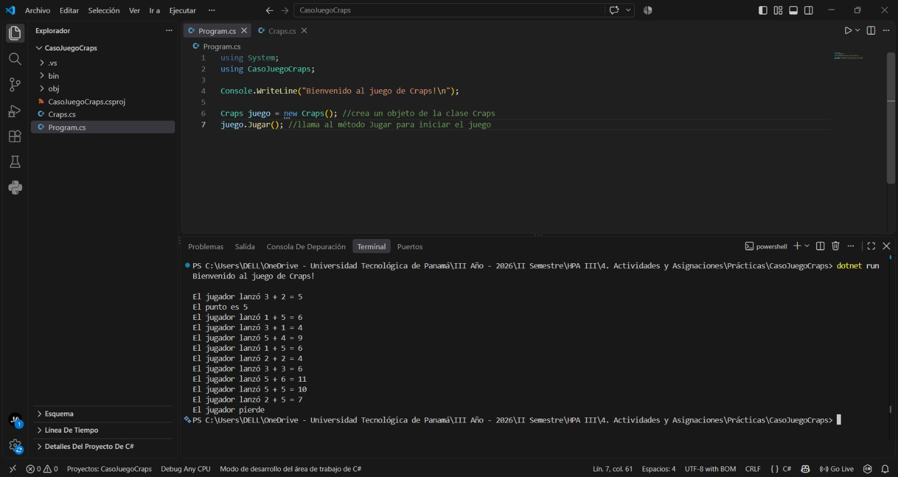
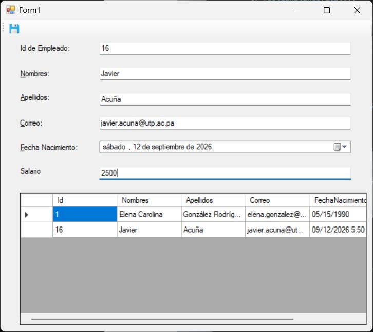
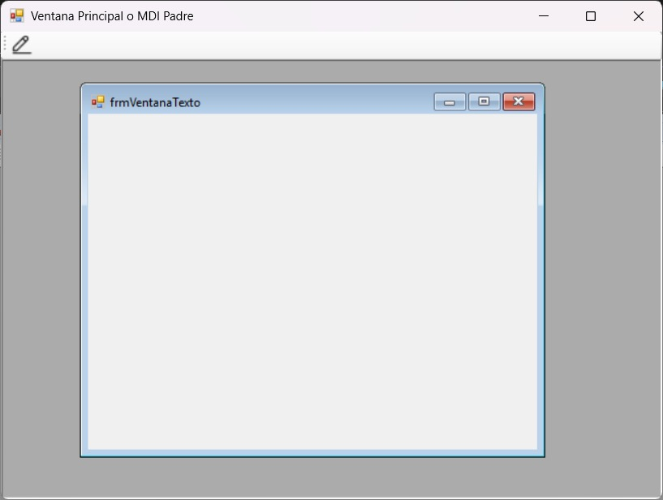

# Laboratorio #3 - Arquitectura de Clases, Validaciones Avanzadas e Interfaces en C#
**Fecha:** 07/09/2026

---

## Contenido del Repositorio
Este laboratorio abarca el diseño de clases orientadas a objetos aplicando encapsulamiento, propiedades y modularidad tanto en consola como en entornos gráficos. Incluye el desarrollo de aplicaciones de escritorio en Windows Forms que interactúan con colecciones de objetos mediante el control DataGridView. Además, se implementan validaciones de nivel profesional utilizando ErrorProvider, expresiones regulares y parseo defensivo, finalizando con la estructuración de navegación visual mediante contenedores MDI (Multiple Document Interface).

---

## Tecnologías Utilizadas
* **Lenguaje / Framework:** C# / .NET (Aplicaciones de Consola y Windows Forms)
* **Base de datos:** N/A (Almacenamiento en memoria mediante colecciones ArrayList o List<T>)[cite: 4]
* **Herramientas:** Visual Studio, Git, GitHub, Visual Studio Code

---

## Capturas de Pantalla y Problemas

### Interfaz Principal





* **CasoJuegoCraps:** Implementación de la lógica del juego de Craps en consola[cite: 4]. Utiliza una enumeración (`enum`) con constantes para representar el estado del juego (CONTINUA, GANA, PIERDE) y la clase `Random` para simular la suma del lanzamiento de los dados[cite: 4]. Se emplean estructuras de control `switch` y `while` para determinar el resultado basado en las reglas del juego[cite: 4].
* **EjemploGrid:** Interfaz gráfica para registrar los datos de un colaborador (ID, Nombres, Apellidos, Correo, Fecha de Nacimiento y Salario)[cite: 4]. Emplea un `DataGridView` enlazado a una colección `ArrayList`[cite: 4]. Se integran validaciones robustas mediante una clase estática `Utilidades` para verificar el formato del correo con expresiones regulares (`Regex`), parseo defensivo (`decimal.TryParse`) para el salario, y el componente `ErrorProvider` para retroalimentación visual de campos vacíos o inválidos[cite: 4].
* **FormularioMDI:** Arquitectura de contenedor que alberga múltiples ventanas hijas. Se configura el formulario principal activando la propiedad `IsMdiContainer = true` y se gestiona la apertura de los formularios secundarios asignándoles la propiedad `MdiParent`. Se incluye una barra de herramientas (`ToolStrip`) con botones acoplados en la parte superior para instanciar y enfocar las ventanas sin que se dupliquen o queden flotando de manera desorganizada[cite: 4, 5].

---

## Estructura de Carpetas o Directorios

```plaintext
Laboratorio-3/
├── CasoJuegoCraps/         # Proyecto de consola con la lógica del juego y enumeraciones
├── EjemploGrid/            # Proyecto Windows Forms con DataGridView, ErrorProvider y clases utilitarias
├── FormularioMDI/          # Proyecto Windows Forms configurado como contenedor padre e hijas
├── docs/                   # Carpeta con capturas de pantalla de evidencia
└── README.md               # Documentación del proyecto
```

---

## Instrucciones de Ejecución / Uso

1. **Clonar el repositorio:**
   ```bash
   git clone [https://github.com/jacu2006/Laboratorio-3.git](https://github.com/jacu2006/Laboratorio-3.git)
   cd Laboratorio-3

---

## Autor y Contexto
* **Nombre:** Javier Alberto Acuña Castro
* **Institución:** Universidad Tecnológica de Panamá[cite: 4]
* **Facultad:** Facultad de Ingeniería en Sistemas Computacionales[cite: 4]
* **Curso:** Módulo II: Elementos Básicos del Lenguaje Orientada a Objetos y Windows Forms - Grupo 1IL133[cite: 4]
* **Instructor:** Ing. Irina Fong[cite: 4, 5]
* **Fecha de Realización:** 07/09/2026[cite: 4]

---

## Referencias
* Guía de laboratorio: *Laboratorio de Validaciones, Métodos Estáticos y Nuevos Controles (DataGridView).docx* - Ing. Irina Fong[cite: 4].
* Presentación: *MDI.pptx (Ventana de Interfaz de Múltiples Documentos)* - Ing. Irina Fong[cite: 5].
